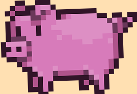
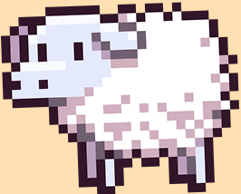

# Welcome to The Farm Challenge!

## Testimonials

> "The farm challenge was crucial in my understanding of state, and where to store it"

 Tina Delgado, pig, aged 6

> "I learnt so much from this exercise, especially about mocking stuff in Axios."

 Helga Larson, sheep, aged 2

> "It really helped my udderstanding of how to componentise properly."

 Blankenship Savage, cow, aged 10

<hr

## What is the purpose of this lesson

1. React fundamentals
   - `useState` and `useEffect` hooks being utilized correctly across multiple components
   - component separation and managing the interfaces between components
   - event handling
   - "lifting state" by having state in a parent component https://react.dev/learn/sharing-state-between-components
   - component callbacks
   - custom hooks
2. TypeScript fundamentals
   - typing component props
   - modelling data from external systems (API) using Typescript
   - using string literals to model discrete lists of data
   - using generics to create reusable code that is still typed correctly
3. TDD
   - Testing an interactive component
   - Snapshot testing
   - Mocking Axios correctly
   - Understanding coverage
   - Testing a react hook

## The challenge - step 1

### Introduction

A farmer needs a UI to help sort and catalog her 1000 animals. You guys are going to build her one.

### Recommended Order of Construction

1. Build `FarmChallengePage` page and put in scaffolding of page (h1, h2 headers, placeholders for component)
2. Build the 'dumbest' component first which is the `AnimalsTable` using MUI table (https://mui.com/material-ui/react-table/), also note some farm animals have appeared in the `public` folder! I'd like them to display with a height of 24px please.
3. Then build the following components:\
   3.1 `NameFilter.tsx`\
   3.2 `AnimalTypeSelect.tsx`\
   3.3 `SortOrderSelect.tsx`\
4. Then wire it all together in the FarmChallenge page!

## NOTE

1. All the API calls are super quick so we don't need `isLoading` indicators
2. Check out the `Farm_Database.pdf` for more details
3. The select lists are populated from the API using Axios (https://www.npmjs.com/package/axios) and are not hardcoded

## The challenge - step 2

Once you have done step 1 and Duncan has done the code through you are ready to test your work. This is the order that you should test in:

1. `AnimalsTable` (easiest)
2. `NameFilter` component (easy)
3. `AnimalTypeSelect` and `SortOrderSelect` (intermediate)

## The challenge - step 3

Now instead of the above component level testing, test the `FarmChallengePage` page as a whole just by testing the `FarmChallengePage`, can you achieve 100% coverage? How does this differ? What might be the pros and cons of each approach?

## Available Scripts

In the project directory, you can run:

### `npm start`

Runs the app in the development mode.\
Open [http://localhost:3000](http://localhost:3000) to view it in the browser.

The page will reload if you make edits.\
You will also see any lint errors in the console.

### `npm test`

Launches the test runner in the interactive watch mode.\
See the section about [running tests](https://facebook.github.io/create-react-app/docs/running-tests) for more information.

### `npm run build`

Builds the app for production to the `build` folder.\
It correctly bundles React in production mode and optimizes the build for the best performance.

The build is minified and the filenames include the hashes.\
Your app is ready to be deployed!

See the section about [deployment](https://facebook.github.io/create-react-app/docs/deployment) for more information.
